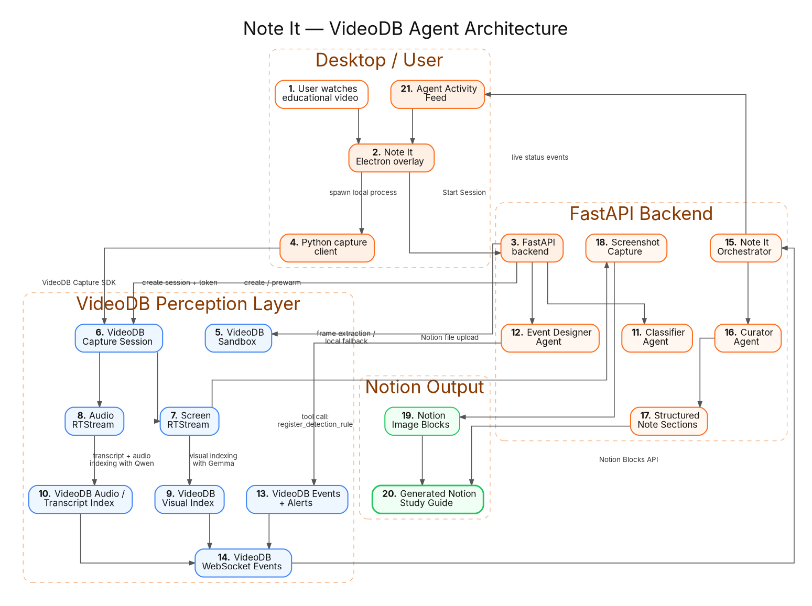
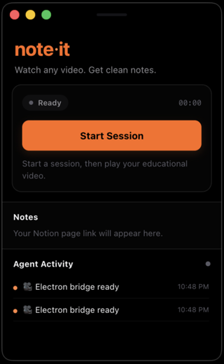
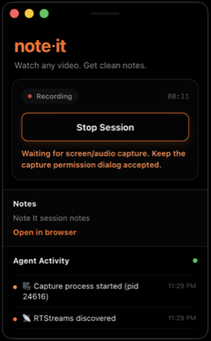
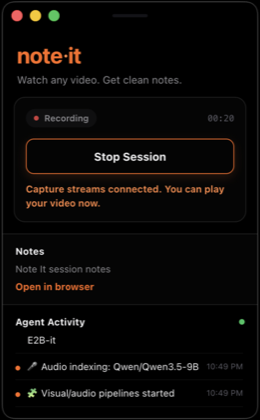

# VideoDB Online Hackathon - Note It

<p align="center">
  <strong>note·it</strong><br />
  Watch any video. Get clean notes.
</p>

Note It is a desktop learning agent for educational videos. It runs as a small floating Electron overlay while you watch a video, captures screen/audio through VideoDB, indexes the live stream with multimodal models, curates structured study notes, attaches screenshots, and writes the result into Notion.

Built for the VideoDB Online Hackathon.

## What It Does

Note It turns a video-watching session into a structured Notion study guide:

- Starts a VideoDB capture session from a desktop overlay.
- Captures screen, microphone, and system audio using the VideoDB Python capture SDK.
- Streams screen/audio into VideoDB RTStreams.
- Uses VideoDB Sandbox-backed visual and audio indexing.
- Uses an Event Designer agent to register custom detection rules through tool-calling.
- Curates rolling windows into clean note sections.
- Uploads screenshots to Notion alongside the notes.
- Shows a live Agent Activity feed in the Electron app.

## Demo

[Demo video on Loom](https://www.loom.com/share/6c3953bdf60a4a9fa93e24ca4b044db5)

## Sample Notion outputs

These were auto-generated by Note It from real screen-capture sessions. 

- [Backpropagation in Neural Networks](https://www.notion.so/Note-It-Backpropagation-in-Neural-Networks-May-17-18-19-36369acc1935810899aff9df93c4152d?source=copy_link)
- [Gradient Descent as an Optimization Method](https://www.notion.so/Note-It-Gradient-Descent-as-an-Optimization-Method-May-17-20-27-36369acc1935812f893fca5a664a9451?source=copy_link)
- [Neural Networks as the Basis of Deep Learning](https://www.notion.so/Note-It-Neural-Networks-as-the-Basis-of-Deep-Learning-May-17-16-51-36369acc193581ee938ac4473cc49ad7?source=copy_link)


## Architecture

<p align="center">
  
</p>

The Electron overlay drives a FastAPI backend, which orchestrates a VideoDB capture session, sandbox-backed multimodal indexing, and two LLM agents — an Event Designer that programs VideoDB's perception layer via tool calls, and a Curator that turns rolling event windows into structured Notion notes.

## VideoDB Usage

This project uses VideoDB as the core perception layer

- **Sandbox**: creates and reuses a VideoDB Sandbox for model-backed indexing workloads.
- **Capture Session**: creates a VideoDB capture session for live desktop capture.
- **Client Token**: generates a client token used by the Python capture client.
- **RTStreams**: consumes screen/audio RTStreams created by the capture client.
- **Visual Indexing**: runs visual indexing over the screen stream using `google/gemma-4-E2B-it`.
- **Audio Indexing + Transcript**: starts transcript capture and audio indexing using `Qwen/Qwen3.5-9B`.
- **Events + Alerts**: dynamically registers VideoDB detection rules from the Event Designer agent.
- **Playback/frame extraction**: uses RTStream playback where available for screenshots, with local fallback.

## Tech Stack

- Electron + React + Vite for the desktop overlay.
- FastAPI for the local backend.
- VideoDB Python SDK for sandbox, capture sessions, RTStreams, indexing, events, and alerts.
- OpenAI-compatible LLM calls for classification, curation, and tool-planning.
- Notion API for page creation, block writing, and image uploads.

## Project Structure

```text
project-root/
  app/                 # Electron + React desktop app
  backend/             # FastAPI backend and VideoDB/Notion adapters
  docs/                # Development plans and phase notes
  .env.example         # Environment variable template
```

## Setup

Clone the repository and move into the project root:

```bash
git clone <your-fork-or-repo-url>
cd VideoDB-Online-Hackathon
```

Example paths:

```bash
# macOS/Linux example
cd ~/projects/VideoDB-Online-Hackathon
```

```powershell
# Windows PowerShell example
cd C:\Users\you\projects\VideoDB-Online-Hackathon
```

All commands below assume you are running them from the project root unless noted otherwise.

### 1. Backend environment

Create and activate a Python environment, then install backend dependencies.

Using conda:

```bash
conda create -n 'envname' python=3.12 -y
conda activate 'envname'
cd /path/to/your/cloned-repo/backend
pip install -r requirements.txt
```

Or using `venv`:

```bash
python -m venv .venv
source .venv/bin/activate
cd /path/to/your/cloned-repo/backend
pip install -r requirements.txt
```

The project expects the VideoDB hackathon SDK branch/version that supports capture, sandbox, RTStreams, and indexing APIs.

### 2. Environment variables

Copy the example file:

```bash
cd /path/to/your/cloned-repo
cp .env.example .env
```

Fill in:

```env
VIDEO_DB_API_KEY=
NOTION_TOKEN=
NOTION_PARENT_PAGE_ID=
OPENAI_API_KEY=
```

Recommended demo defaults:

```env
USE_SANDBOX=true
SANDBOX_TIER=small
VISUAL_INDEX_MODEL=google/gemma-4-E2B-it
AUDIO_INDEX_MODEL=Qwen/Qwen3.5-9B
CURATOR_INITIAL_WINDOW_SECONDS=12
CURATOR_WINDOW_SECONDS=20
```

The demo flow was tested with `SANDBOX_TIER=small`.

### 3. Electron app dependencies

```bash
cd /path/to/your/cloned-repo/app
npm install
```

## Running The App

### 1. Start backend

```bash
cd /path/to/your/cloned-repo/backend
python -m app.main
```

The backend prewarms the VideoDB Sandbox on startup. For a smoother demo, start the backend before recording and wait until the backend prints:

```text
INFO:     Waiting for application startup.
INFO:     Application startup complete.
```

You can verify backend health:

```bash
curl http://127.0.0.1:8000/health
```

### 2. Start Electron

Use the Python interpreter from the environment where `videodb` is installed:

```bash
cd /path/to/your/cloned-repo/app
NOTEIT_PYTHON="$(which python)" npm run dev
```

If you use conda, make sure the same environment is activated before running Electron:

```bash
conda activate noteit
cd /path/to/your/cloned-repo/app
NOTEIT_PYTHON="$(which python)" npm run dev
```

`NOTEIT_PYTHON` must point to the Python interpreter that has the VideoDB SDK installed.

Windows PowerShell example:

```powershell
conda activate noteit
cd C:\path\to\your\cloned-repo\app
$env:NOTEIT_PYTHON = (Get-Command python).Source
npm run dev
```

### 3. Run a session

1. Open an educational YouTube video (play video on any platform or local video).
2. Wait until the backend is healthy and Electron shows the Note It overlay.
3. Click **Start Session** in the Note It overlay.

<p align="center">
  
</p>

4. Wait for `RTStreams discovered` and `Visual/audio pipelines started`.

<p align="center">
  
  
</p>

5. Watch the video normally.
6. Open the Notion link from the overlay.
7. Click **Stop Session** when done.

Always stop the session from the UI before shutting down the backend so the sandbox can be stopped cleanly. The system writes notes in rolling windows. It is designed for near-real-time structured note-taking, not instant transcription. Some delay is expected because the app waits for enough transcript/visual/audio signal, curates a note window, extracts screenshots, and writes blocks to Notion.

## Current Limitations

- Notes are generated in rolling windows, so adjacent sections can sometimes be repetitive.
- Sandbox startup can take time; backend prewarming reduces the visible wait during demos.

## Why This Matters

Educational videos contain visual context, spoken explanation, slides, diagrams, code, and examples. Most note-taking tools reduce that to plain transcript. Note It uses VideoDB’s multimodal indexing and event system to preserve more of the learning context and turn a passive video session into an organized study artifact.

## Future Scope

- Add packaged desktop builds for macOS/Windows instead of dev-mode Electron.
- Add a session history view for reopening previous Notion outputs from the desktop app.
- Tune larger sandbox tiers and model choices for lower latency and better note quality.
